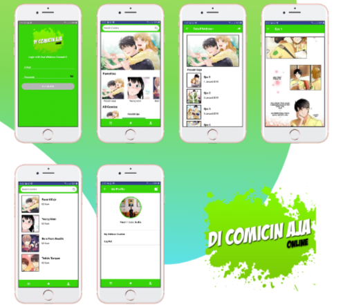

<h1 align="center">
   
</h1>

## Important

This project is still on very early development stage. If you want to use for production, use it with your own risk.
 More feature Coming Really Soon.

## What is DiComicin Aja ?

KOMIKIN AJA is a mobile-based comic reading application that can run on Android or iOS. we can read comics for free and online. and for creators around the world can contribute to making online comics here

## Screenshots

  

## Features

- Login & Register
- Reading Comics
- Favorite Comics by User
- Comics Creator Area (Upcoming Features)

## Tech Stack

- React Native for the Mobile Frontend
- Express JS for BackEnd

## Support Me :)

- Star this repository :
- Hire Me https://bit.ly/izzalinked

## Contact

- WA/TELEGRAM: +62 822 6091 1152
- email: izzasrv@gmail.com
